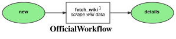

Markdown for OfficialWorkflow




## fetch_wiki -- guard


```php
#[AsGuardListener(self::WORKFLOW_NAME, self::TRANSITION_FETCH_WIKI)]
public function onGuard(GuardEvent $event): void
{
    if (!$this->getOfficial($event)->getWikidataId()) {
        $event->setBlocked(true, "missing wiki id.");
    }
}
```
blob/main/src/Workflow/OfficialWorkflow.php#L37-42
        


## fetch_wiki -- transition


```php
#[AsTransitionListener(self::WORKFLOW_NAME, self::TRANSITION_FETCH_WIKI)]
public function onTransition(TransitionEvent $event, ): void
{
    $official = $this->getOfficial($event);
    $filesystem = $this->defaultStorage;
    $this->wikiService->setCacheTimeout(60 * 60 * 24);
    $wikiData = $this->wikiService->fetchWikidataPage($official->getWikidataId());
    $official->setWikiData($wikiData);
    $this->entityManager->flush();

}
```
blob/main/src/Workflow/OfficialWorkflow.php#L45-54
        
